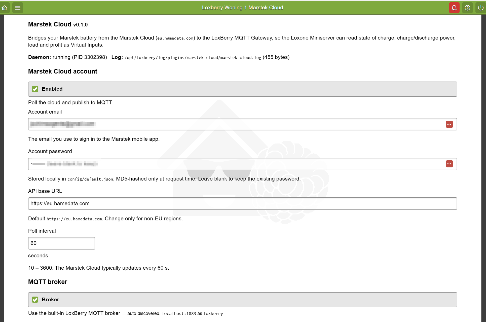
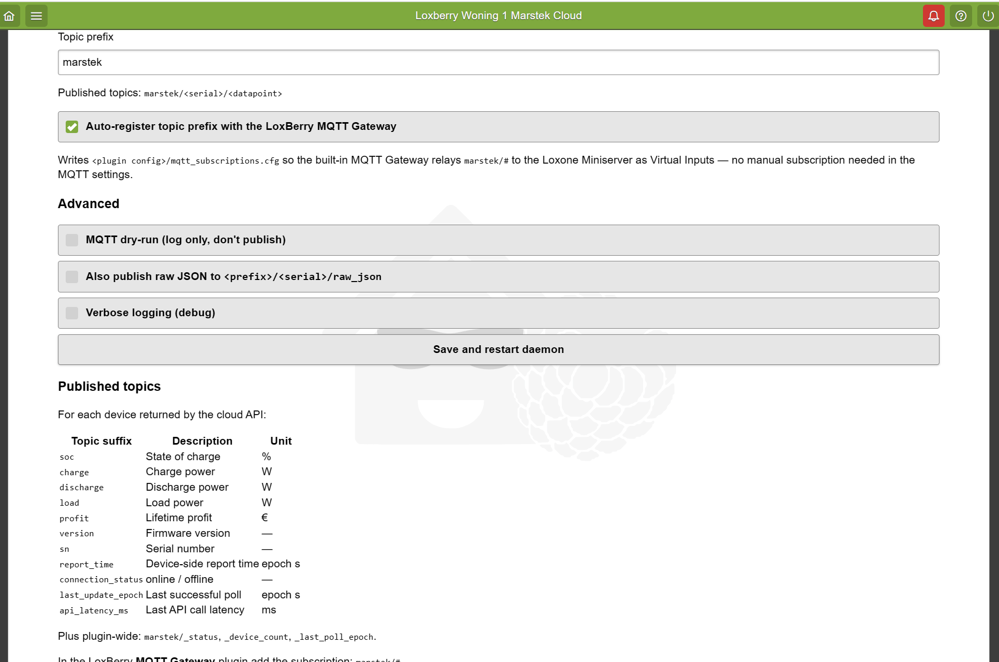
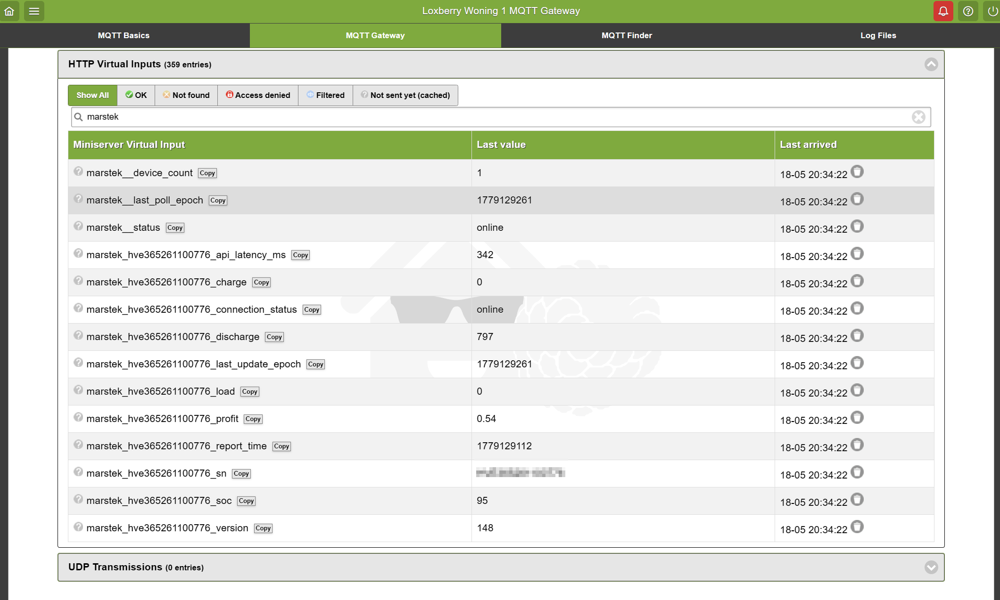

# LoxBerry Integrator

Create production-quality LoxBerry plugin repositories that bridge external devices and services into a Loxone Miniserver. Prefer MQTT Gateway for new integrations unless the user or device protocol makes UDP, direct REST, or Modbus TCP more appropriate.

## Operating Model

1. Treat the user's request as a plugin product brief, not just a code-generation prompt.
2. Generate a complete, installable repository when enough information is available.
3. Ask only for missing information that changes architecture, security, or device behavior. Otherwise use the defaults below and call them out.
4. Keep generated code auditable: explicit configuration, no hidden credentials, predictable paths, and bounded retries.
5. Validate the generated repository before presenting it.

## Required Inputs

Gather or infer:

| Input | Default | Why it matters |
|---|---:|---|
| Device or service name | required | Sets naming, docs, and UI labels |
| Protocol | MQTT | Selects daemon pattern and dependencies |
| Direction | inbound | Determines topics, commands, and Loxone objects |
| Data points | required | Defines MQTT topics, config, docs, and validation |
| Polling or event-driven | polling | Determines daemon lifecycle and rate limits |
| Authentication | none | Determines secure config fields and UI treatment |
| Preferred language | Python | Python is the default for daemon code; Perl is preferred for LoxBerry web UI |
| GitHub owner/repo | placeholders | Required for final release URLs |

If data points are underspecified, generate a small, named starter map and mark it as user-editable in docs.

## Architecture Selection

Read `references/integration-patterns.md` when choosing implementation details.

| Pattern | Use when | Default transport to Loxone |
|---|---|---|
| `mqtt-bridge` | Cloud APIs, local REST APIs, normal sensor polling, most new integrations | MQTT Gateway |
| `modbus-tcp` | Energy meters, inverters, heat pumps, industrial devices | MQTT Gateway |
| `udp-relay` | Legacy devices that emit UDP or high-frequency datagrams | Virtual UDP Input or MQTT |
| `rest-gateway` | LAN devices with simple HTTP JSON APIs | MQTT Gateway |
| `command-bridge` | Loxone controls an external device/service | HTTP endpoint and/or MQTT command topic |

Prefer `mqtt-bridge` unless a specific protocol requirement overrides it.

## Repository Contract

Generate this structure unless the user asks for a smaller patch:

```text
LoxBerry-Plugin-{name}/
  plugin.cfg
  release.cfg
  prerelease.cfg
  README.md
  LICENSE
  bin/
    {plugin}.py
  config/
    default.json
  daemon/
    daemon
  webfrontend/
    htmlauth/
      index.cgi
  templates/
    settings.html
  icons/
    icon_64.png
    icon_128.png
    icon_256.png
    icon_512.png
  docs/
    LOXONE_CONFIG.md
```

Use the templates in `assets/` as starting points:

- `plugin.cfg.template`
- `release.cfg.template`
- `default.json.template`
- `daemon.template`
- `index.cgi.template`
- `settings.html.template`
- `README.md.template`
- `LOXONE_CONFIG.md.template`
- `LICENSE`

## Naming Rules

1. Normalize plugin identity to lowercase ASCII with hyphens: `my-device-bridge`.
2. Use the same immutable value for `PLUGIN.NAME` and `PLUGIN.FOLDER`.
3. Use a clear human title for `PLUGIN.TITLE`: `My Device Bridge`.
4. Include `INTERFACE=2.0` in the `[PLUGIN]` section for LoxBerry 3.x compatibility.
5. Use MQTT topics in this shape:

```text
{plugin}/{device_id}/{datapoint}
```

For single-device plugins, use `main` as `device_id` unless the device has a stable serial number or user-provided identifier.

## LoxBerry Rules

Read `references/loxberry-api-reference.md` when writing code that touches LoxBerry runtime paths, `plugin.cfg`, daemon wrappers, or release manifests.

Must follow:

- Use LoxBerry environment variables such as `LBPCONFIGDIR`, `LBPLOGDIR`, `LBPBINDIR`, `LBPTEMPLATEDIR`, and `LBPHTMLAUTHDIR`.
- Never hardcode `/opt/loxberry` except as a clearly marked local-development fallback.
- Store credentials only in `config/default.json` or user-provided secret stores; never embed real credentials in code or docs.
- Redact secrets in logs.
- Use bounded retries with exponential backoff.
- Handle `SIGTERM` and `SIGINT` gracefully.
- Keep network timeouts explicit.
- Document every port the plugin listens on.
- **Auto-register the MQTT topic prefix with the LoxBerry MQTT Gateway.** Any plugin in the `mqtt-bridge` (or `command-bridge` over MQTT) pattern MUST write `<lbpconfigdir>/mqtt_subscriptions.cfg` containing the plugin's topic pattern (e.g. `<prefix>/#`) on every daemon start. The built-in `mqttgateway.pl` watches that file with inotify and merges it into the active subscription list — no manual subscription step in the Gateway UI. Without this, freshly published topics appear in `mosquitto_sub` but never surface in the MQTT Gateway *Incoming Overview*, and the user cannot convert them to Virtual Inputs. See `register_mqtt_subscription()` in `references/integration-patterns.md → MQTT Bridge → Topic subscription auto-registration` for the canonical 6-line helper; expose the behavior behind a `register_mqtt_subscription: true` config checkbox (default on) so users who run their own MQTT-to-Loxone relay can turn it off.
- **Ship plugin icons.** Every plugin MUST include `icons/icon_64.png`, `icons/icon_128.png`, `icons/icon_256.png`, and `icons/icon_512.png`. `plugininstall.pl` copies them to `/opt/loxberry/webfrontend/html/system/images/icons/<folder>/` and uses them in the *Plugin Management* tile grid and the top-navigation breadcrumb. If any of the four are missing, the installer logs `<ERROR> ICON files: Icons could not be (completely) installed. Using some default icons.` and substitutes generic LoxBerry defaults — your plugin then renders as visually identical to every other un-iconed plugin in the user's UI. Generate the four PNGs from the same source (a flat rounded-square tile + a domain-specific glyph works well; Pillow's `ImageDraw` is enough — no external graphics tool needed) and keep file sizes small (<10 KB per icon for simple flat designs).

## Output Response Contract

When generating or modifying a plugin repository, finish with:

1. What was generated or changed.
2. The selected integration pattern and why.
3. Assumptions/defaults used.
4. Validation performed and any remaining manual checks.
5. Next steps for the user: install ZIP, configure plugin, map MQTT topics, or edit data points.

Do not bury warnings. If a plugin cannot be made installable without missing device-specific information, say exactly what remains unresolved.

## Validation

Before final delivery:

1. Ensure `plugin.cfg` has `[AUTHOR]`, `[PLUGIN]`, `[AUTOUPDATE]`, and `[SYSTEM]`.
2. Ensure `VERSION`, `NAME`, `FOLDER`, `TITLE`, and `INTERFACE` are present.
3. Ensure `NAME` and `FOLDER` match lowercase `^[a-z0-9][a-z0-9-]*$`.
4. ZIP Structure: Files must be at the root of the ZIP, OR the single subfolder name MUST match the `FOLDER` parameter exactly. (GitHub "Download ZIP" often fails this check because it adds a version/branch suffix).
5. Ensure `release.cfg` and `prerelease.cfg` point to plausible GitHub archive URLs or are explicitly placeholder-marked.
6. Ensure daemon code handles shutdown and does not hardcode production LoxBerry paths.
7. Ensure docs map every generated MQTT topic or command endpoint.
8. Ensure generated README explains installation, configuration, logs, troubleshooting, and license.
9. Ensure the four icon files exist at `icons/icon_{64,128,256,512}.png` (LoxBerry substitutes generic defaults — and logs an `<ERROR>` — when any are missing).
10. For MQTT-pattern plugins, ensure the daemon writes `<lbpconfigdir>/mqtt_subscriptions.cfg` (containing at minimum `<prefix>/#`) at startup so the built-in MQTT Gateway picks the topics up via inotify.
11. If a generated plugin path exists locally, run:

```bash
python scripts/validate_plugin.py <generated-plugin-path>
```

## Gotchas

- **Must be packaged as a ZIP to be installed.** LoxBerry's plugin installer only consumes `.zip` archives via the web UI (`Plugin Install` page) or `loxberryupdate`. A raw folder, `.tar.gz`, or GitHub "Source code (zip)" with a branch/tag suffix folder name will be rejected or installed under the wrong folder name. Always produce a `.zip` whose root folder name exactly matches the `FOLDER` value in `plugin.cfg`, or whose contents (plugin.cfg etc.) sit at the archive root. Use `scripts/validate_plugin.py` plus a final `python -m zipfile -l <plugin>.zip` sanity check before handing off.
- **Must be tested on a real LoxBerry sandbox before declaring done.** A plugin that passes static validation can still fail at install time (missing dependencies, wrong `INTERFACE`, daemon path issues, permission problems, Perl/Python version mismatches, `HTML::Template` syntax errors, CGI not flagged executable). The supported sandbox is a **dockerized LoxBerry** — see *Sandbox bootstrap* in *Mandatory Final Steps* below for the conditional setup procedure. Iterate: install → open the plugin page in the browser to confirm it renders inside the LoxBerry shell → check `/opt/loxberry/log/plugins/<plugin>/` → fix → rebuild ZIP → reinstall, until the daemon runs cleanly and MQTT/Loxone data flows as designed. The VirtualBox path under `sandbox/tools/build-loxberry-vm.ps1` exists but is deprecated; do not use it unless the task specifically requires a real LAN-attached LoxBerry host (e.g. Miniserver auto-discovery).
- **Plugin web UI must live inside the LoxBerry shell.** The generated `webfrontend/htmlauth/index.cgi` must call `LoxBerry::Web::lbheader($title, $helpurl, $helptemplate)` before printing the template and `LoxBerry::Web::lbfooter()` after — never print a custom `<html>`/`<head>`/`<body>`. Inside `templates/*.html`, use only stock `HTML::Template` tags (`<TMPL_VAR>`, `<TMPL_IF>`, `<TMPL_LOOP>`, `<TMPL_ELSE>`); **do not** use `<TMPL_IF EXPR="...">` (that's `HTML::Template::Expr`, not loaded by LoxBerry) — compute the boolean in the CGI and pass it as a plain named param.
- **Never let a CGI subshell print to STDOUT.** Anything a `system(...)` / `qx{...}` call writes to stdout becomes part of the HTTP response body — and if it appears before the CGI's `print $cgi->header(...)`, Apache sees garbage where it expects HTTP headers and returns its generic 500 page (`LoxBerry - Error :-(`). Always redirect subprocess output explicitly: `system("$daemon restart >>'$lbplogdir/daemon-restart.log' 2>&1")` for restart actions, or `qx{$cmd 2>&1}` if you need to capture and conditionally display the output. The installer-placed daemon hook at `/opt/loxberry/system/daemons/plugins/<folder>` is the only correct path for restart from a CGI — `$lbpbindir/../daemon/daemon` does not exist post-install.
- **Python plugin dependencies go in `dpkg/apt`, not `requirements.txt`.** The LoxBerry installer parses `<plugin>/dpkg/apt` (one Debian package name per line) and runs `apt-get install -y` at install time. `requirements.txt` is silently ignored. Always ship deps as the Debian package equivalent: `python3-paho-mqtt`, `python3-requests`, `python3-yaml`, etc. Keep `requirements.txt` only as developer documentation; it does nothing at install time.
- **The daemon hook is invoked twice in different contexts.** `loxberry.service` runs the hook at boot **with no arguments and as root**. At that point `LBHOMEDIR` and the plugin-parent dirs `LBPBIN`/`LBPCONFIG`/`LBPDATA`/`LBPLOG`/`LBPHTMLAUTH`/`LBPHTML`/`LBPTEMPL` **are exported** via `/etc/environment` (the unit has `EnvironmentFile=/etc/environment`). The **per-plugin** `LBP*DIR` (e.g. `LBPBINDIR=$LBPBIN/<plugin>`, `LBPLOGDIR=$LBPLOG/<plugin>`) are **not** — derive those yourself. The plugin web UI invokes the same file **with `restart` and as the `loxberry` user** under Apache. The wrapper must (a) default `${1:-start}`, (b) derive its per-plugin paths from `$LBHOMEDIR` + a hardcoded plugin folder name (or, defensively, `[ -z "${LBHOMEDIR:-}" ] && . /etc/environment` at the top — never default to a hardcoded `/opt/loxberry` literal), (c) `su loxberry -c` only when running as root (Apache CGI can't `su`), and (d) `rm -f $PIDFILE` if the daemon fast-exits — otherwise the next status check reports "stopped (stale pidfile)" forever. The baseline `assets/daemon.template` already implements this contract; do not regress it. The daemon binary itself must **soft-exit 0** (with a clear log line) when mandatory user-supplied config is missing — raising an exception leaves a stale pidfile on every boot until the user opens the plugin page.

- **Never hardcode the LoxBerry install root in daemon scripts or CGIs.** The LoxBerry installer scans daemon hooks (and other shipped scripts) with `grep -l '/opt/loxberry'` and emits `WARNING ... HARDCODED PATH'S: ... should be fixed by the Plugin author` on every install if it finds **any** match — including the literal in a *comment*. Always use `$LBHOMEDIR` (bash) / `$lbhomedir` (Perl, exported by `LoxBerry::System`) / `os.environ["LBHOMEDIR"]` (Python). For the per-plugin daemon hook path use `$lbhomedir/system/daemons/plugins/<plugin>` from the CGI — there is no env var for the `system/daemons/plugins/` parent dir.

- **Strip whitespace from credential inputs on both save and load.** Password managers (and the browser's autofill) routinely paste a leading or trailing space into the password field. A single extra space changes the MD5 / hash / token and the upstream API rejects the otherwise-correct credential — confusing the user because the password "looks right". Always run `s/^\s+|\s+$//g` (Perl) / `.strip()` (Python) on the form values in the CGI save handler and again in the daemon's `load_config()`. Same rule for any other text credential (API tokens, device IDs).

- **LoxBerry's plugin installer overwrites `config/*` on every install/upgrade.** `plugininstall.pl` does `cp -r tempfolder/config/* $lbhomedir/config/plugins/$pfolder` unconditionally — there is no "first-install only" branch. A user who entered credentials, then installs a plugin upgrade, **loses their settings**. Two acceptable patterns: (a) ship the file as a template that the user re-fills on first save (single round of re-entry per upgrade — easier to implement, what most LoxBerry plugins do today); (b) split into a read-only `config/defaults.json` (template, gets overwritten — fine) and a separate `config/user.json` that the installer never sees (preserved across upgrades — the CGI/daemon merge them on load). Whichever pattern you pick, set the saved credential file to mode **`0600 loxberry:loxberry`** in both the CGI save handler and the daemon's `load_config()` — the installer ships at `0644` and any plaintext password inside is otherwise world-readable on the host.

- **Validate every user-controlled URL against an allow-list — on both save and load.** Plugins commonly expose an `api_base_url` / webhook / upstream-endpoint field that the user can edit. Combined with LoxBerry's plain-HTTP-Basic auth (no CSRF protection at the framework level), an unvalidated URL field is a credential-exfil chain: an attacker page can CSRF-POST to the save endpoint with `api_base_url=https://attacker.example`, and the daemon will then POST the (hashed) credentials to the attacker host on the next poll cycle. **Worse**: `urllib.request.urlopen` in Python's stdlib accepts `file://`, `ftp://`, and other schemes. Mitigation: in the CGI save handler, reject any URL whose host is not on an explicit allow-list (typically the vendor's domain — e.g. `*.hamedata.com` — plus `localhost` for development). In the daemon, repeat the same allow-list check at startup and soft-exit with a clear log line if it fails. This is a "must-have" for any plugin that uses outbound HTTP with credentials.

- **Redact secrets in error logs, not just info logs.** It is easy to remember to redact the password when writing `LOGINF "logged in as $user"`. It is easy to forget that `raise MarstekCloudError(f"HTTP POST {url} failed: {err}")` — where `url` ends in `?pwd=<md5>&mailbox=<email>` — leaks both the hash and the email on every transient network failure. Always feed URLs through a `redact_url()` helper that strips the query string before logging. Same rule for traceback handlers and any `LOGERR` / `logging.exception` site.

## Mandatory Final Steps

After scaffolding and validating the code, you MUST execute the following mandatory steps before finishing:

1. **Zip the Plugin**: Package the generated LoxBerry plugin into a `.zip` file with the correct folder structure (the root of the ZIP must be the plugin directory matching the `FOLDER` configuration parameter).
2. **Publish to GitHub**: Create a private GitHub repository for the plugin. Ensure it has a well-formatted `README.md`, an appropriate repository name, a clear description, and relevant repository topics.
3. **Sandbox bootstrap (conditional)**: Make sure a dockerized LoxBerry sandbox is running on the host.
   - **Check first** with `docker ps --filter name=loxberry-sandbox --format '{{.Names}} {{.Status}}'`. If a row comes back with status `Up …`, **skip the rest of this step** — the sandbox is already running and ready.
   - If the container exists but is stopped (no row in `ps`, but `docker ps -a --filter name=loxberry-sandbox` shows it), bring it up with `docker compose -f sandbox/tools/docker-compose.yml start`.
   - If there is no `loxberry-sandbox` container at all, create one: requires Docker Desktop running, then `cd sandbox/tools && docker compose pull && docker compose up -d`. First pull is ~1.1 GB. The compose file (`sandbox/tools/docker-compose.yml`) sets the right `privileged: true` + `cgroup: host` flags for systemd-in-Docker on Docker Desktop / WSL2; without those, the LoxBerry container exits 255 in under a second.
   - The container ships LoxBerry 3.0.1.3 (DietPi base), mosquitto on `localhost:1883`, web UI on `http://localhost:18080` (Basic Auth `loxberry`/`loxberry`), and bind-mounts the freshly-built plugin ZIP at `/incoming/<plugin>-<version>.zip` ready to install.
4. **Test in the sandbox**: Install the plugin via the official LoxBerry installer (SecurePIN is `1234` in the sandbox — set it on first use with `perl -e "print crypt(q{1234}, q{IG})" > /opt/loxberry/config/system/securepin.dat`). Idempotent install command (works for upgrades too):

   ```bash
   MSYS_NO_PATHCONV=1 docker exec loxberry-sandbox bash -c '
     export PERL5LIB=/opt/loxberry/libs/perllib
     /opt/loxberry/sbin/plugininstall.pl action=install file=/incoming/<plugin>-<version>.zip pin=1234
     chmod 755 /opt/loxberry/webfrontend/htmlauth/plugins/<plugin>/index.cgi
   '
   ```

   Then open `http://localhost:18080/admin/plugins/<plugin>/index.cgi` and verify the page renders inside the LoxBerry shell (top navigation visible, no `Software error` page). Watch the daemon log at `/opt/loxberry/log/plugins/<plugin>/` and the MQTT topics with `docker exec loxberry-sandbox mosquitto_sub -h localhost -t '<prefix>/#' -v`. Iterate until the daemon runs cleanly and data flows as designed.

5. **Publish + release**: `gh repo create` the project repo, push `main`, then `gh release create v<version>` and **attach the install ZIP as a release asset**. Keep the URLs in `release.cfg` / `prerelease.cfg` pointing at the asset (`…/releases/download/v<version>/<plugin>-<version>.zip`).
   - **PUBLIC** repo: the asset URL works for anonymous downloads — LoxBerry's "Install from URL" path works directly, and the auto-update mechanism (`AUTOUPDATE.RELEASECFG`) resolves.
   - **PRIVATE** repo: the asset URL returns HTTP 404 anonymously. LoxBerry's installer cannot fetch it and reports `CRITICAL: Plugin file does not exist`. The user must download the ZIP through the GitHub web UI / `gh release download` and upload it via *Plugin Management → Plugin Install → Choose File* (file upload, not URL). Document this clearly in the README if the project is private, or flip to public when you're ready for the URL path to work.

## Reference output: marstek-cloud

The `sandbox/Marstek-cloud/` plugin is the canonical worked example produced by this skill. Use it as the visual + structural benchmark when generating a new plugin: if the new plugin's UI does not look and behave like these screenshots (LoxBerry shell wrapping, status pill, auto-discovered MQTT broker line, "Save and restart daemon" returning HTTP 200, MQTT virtual inputs appearing in the Gateway), something in the daemon hook, CGI, template, or `dpkg/apt` step is wrong.

### Plugin settings page — account section

The web UI renders **inside the LoxBerry shell** (note the LoxBerry top navigation and the *Marstek Cloud* breadcrumb), shows a live **`Daemon: running (PID …)`** pill, and surfaces the log path + size. The password input is empty-with-mask placeholder so a subsequent save does not overwrite a stored value with whitespace.



### Plugin settings page — MQTT + advanced

The *"Use the built-in LoxBerry MQTT broker"* checkbox is **checked by default** and shows the **auto-discovered** broker line (`localhost:1883 as loxberry`) read live from `LoxBerry::IO::mqtt_connectiondetails()`. The *"Auto-register topic prefix with the LoxBerry MQTT Gateway"* checkbox is also on by default — the daemon writes `<prefix>/#` to `<lbpconfigdir>/mqtt_subscriptions.cfg` and the built-in `mqttgateway.pl` picks it up via inotify, **no manual subscription step needed**.



### Live MQTT Gateway view — virtual inputs flowing to Loxone

End-to-end proof that the published topics arrive at the Loxone Miniserver as Virtual Inputs. The Gateway lists `marstek/_status`, `marstek/_device_count`, `marstek/_last_poll_epoch` (plugin-wide health) and `marstek/<sn>/{soc,charge,discharge,load,profit,version,sn,report_time,connection_status,last_update_epoch,api_latency_ms}` (per-device datapoints). All rows show status **OK** — no manual subscription was configured; the plugin's `mqtt_subscriptions.cfg` did it.



If your generated plugin's output does not look like these three views once installed + configured, run the diagnostic ladder: (1) is the daemon running? (2) does the plugin page render inside the LoxBerry shell (lbheader/lbfooter)? (3) does `<lbpconfigdir>/mqtt_subscriptions.cfg` exist and contain `<prefix>/#`? (4) is the LoxBerry built-in MQTT Gateway subscribed to it (check `mqttgateway.log`)?

## Memory Boundaries

Use runtime memory for the current device brief, inferred assumptions, and unresolved questions. Do not persist these automatically.

Use project-local files only when the user asks to create or update a plugin repository or this skill package.

Do not write cross-agent shared memory from this skill. If reusable knowledge should be shared beyond this skill, treat that as an explicit external shared-memory workflow.

## References

- `references/integration-patterns.md`: implementation patterns and daemon guidance.
- `references/loxberry-api-reference.md`: LoxBerry paths, metadata, lifecycle, ports, and release rules.
- `examples/example-request.md`: realistic input prompt for forward testing.
